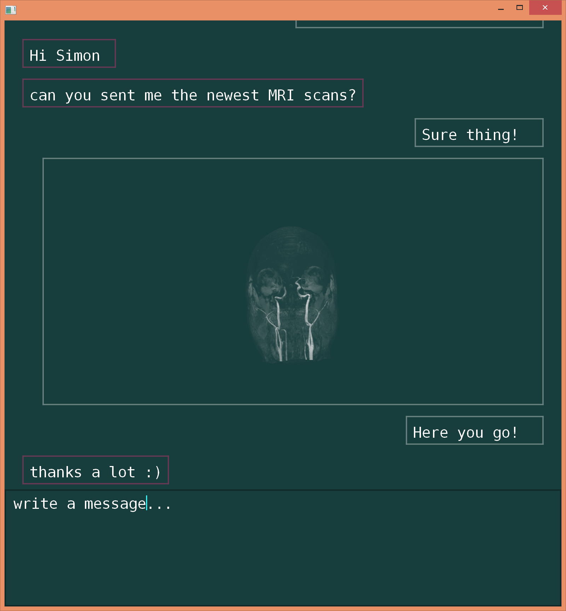

# Osmosis

Is a chat client for [Toxcore](https://tox.chat/), allowing to insert runnable program snippets and interactive graphics and GUI elements.

]

Presented at JuliaCon 2015
https://youtu.be/hdCURYg05jE?t=254

Osmosis is currently not in a working state since the API's changed too much over last year.
I'm hoping to get back at this project and transform it into an awesome chat client for research labs, students, and people that want to program/research with friends in their freetime.
